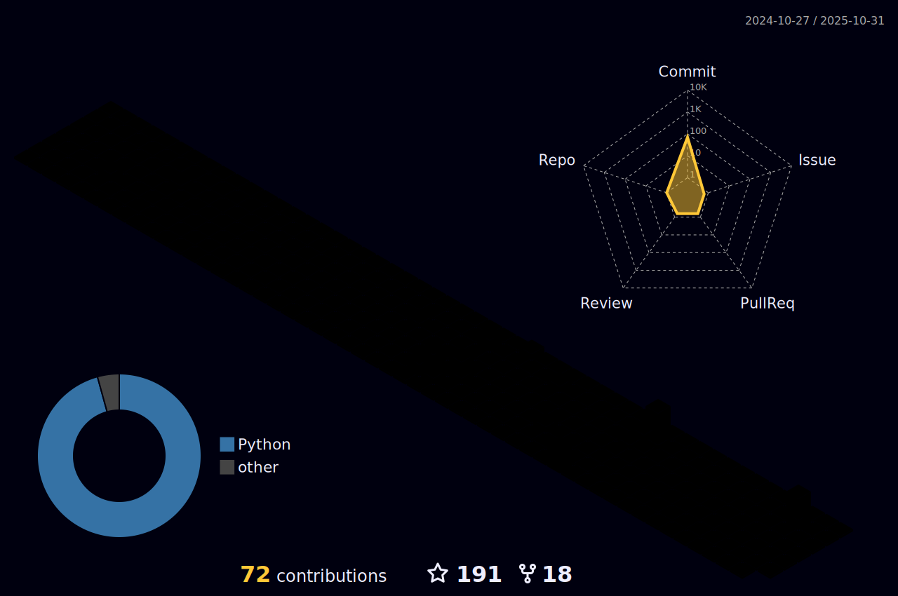

    

 
    
     

🔭 I’m pursuing my doctor's degree in Software Engineering at SDU!

🌱 My current research interests include Deep Graph Clustering and Graph Neural Networks.

<h3>
    

        Benyu Wu's GitHub Stats
    

</h3>

    

    

<h3>
    

        My Skill Set
    

</h3>

    
    
    
    
    
    

<h3>
    

        Total Visits
    

</h3>

    

